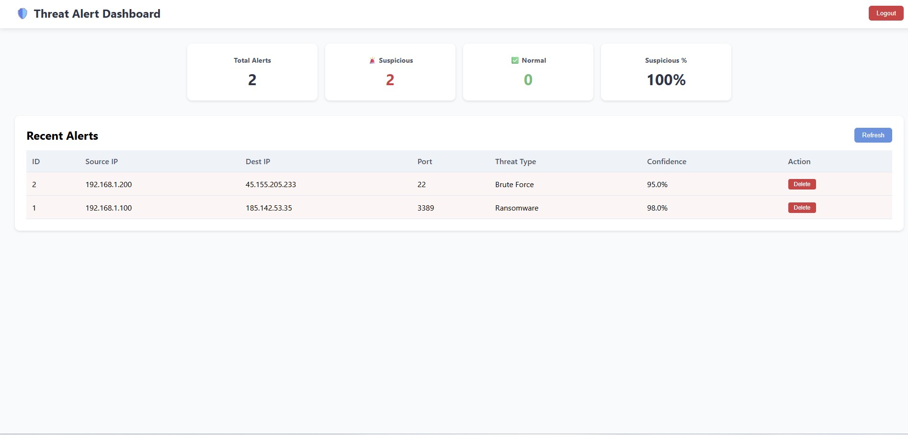

# 🛡️ Threat Alert Dashboard

A real-time dashboard for managing cybersecurity threat alerts, built with React, TypeScript, and connected to a live FastAPI backend.

## 🌐 Live Demo

**Frontend (React):** [threat-dashboard.vercel.app](https://threat-dashboard.vercel.app)

**Backend API (FastAPI):** [web-production-30aa2.up.railway.app/docs](https://web-production-30aa2.up.railway.app/docs)

## ✨ Features

- User registration & JWT authentication
- Real-time threat statistics (total, suspicious, normal)
- Interactive alerts table with delete functionality
- Responsive design
- Connected to live PostgreSQL database
- Type-safe React with TypeScript

## Screenshot



*Dashboard showing threat alerts with statistics cards and alerts table.*

## 🛠️ Tech Stack

| Category | Technologies |
|----------|--------------|
| Frontend | React, TypeScript, Axios, CSS |
| Backend | FastAPI, Python, JWT |
| Database | PostgreSQL |
| Deployment | Vercel (frontend), Railway (backend) |
| Containerization | Docker, Docker Hub |

## 🚀 Quick Start (Local Development)

### Prerequisites

- Node.js (v14 or later)
- npm or yarn

### Installation

```bash
git clone https://github.com/Aikaksh-Singh-Routela/threat-dashboard.git
cd threat-dashboard
npm install
npm start
